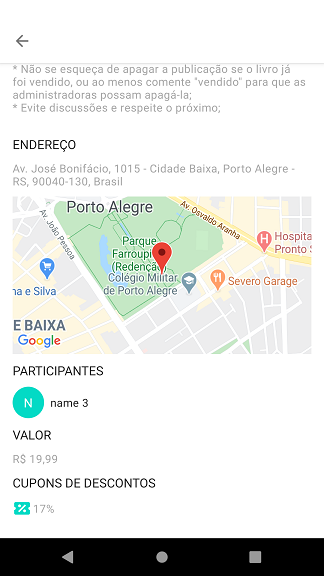
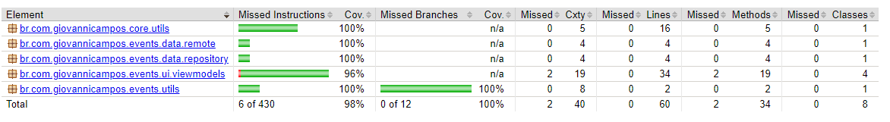

# Eventos

Este projeto é um aplicativo que renderiza uma lista de eventos e seus detalhes a partir de um serviço REST.

## Arquitetura usada
O projeto citado faz uso da **Clean Architecture**, que tem como objetivo separar responsabilidades, seguir os princípios SOLID e simplificar a manutenção do código.

Mais informações sobre a arquitetura poderão ser consultadas em:
[The Clean Architecture - The Clean Code Blog (Robert C. Martin)](https://blog.cleancoder.com/uncle-bob/2012/08/13/the-clean-architecture.html "The Clean Architecture - The Clean Code Blog (Robert C. Martin)")

## Estrutura da arquitetura
- **domain**: onde são inseridas as entidades que representam a regra de negócio da aplicação;
- **data**: abstrações e contratos que representam as ações core da aplicação;
- **interactors** (ou use cases): classes de casos de usos que representam as interações do usuário;
- **framework**: implementações da camada *data*, que servem para realizar as conexões de dados (remotos ou locais);
- **mappers**: adaptadores e conversores;
- **presentation**: camada que implementa a **MVVM** (Model-View-ViewModel), onde é realizada a comunicação entre interface do usuário e os casos de usos;
- **di**: camada usada para injeção de dependências.

## Bibliotecas utilizadas
- **Material**: componentes que seguem as guidelines da Material Design;
- **Coil**: biblioteca de renderização de imagens em cache, além de possuir uma forma mais simples e atualizada de implementar, possui integração nativa com o Kotlin e com o Coroutines;
- **Lifecycle**: conjunto de bibliotecas necessárias para o uso do Android Architectural Components do Jetpack. Necessárias para a implementação da arquitetura do projeto;
- **Koin**: biblioteca leve e integrada com o Kotlin para implementação de injeção de dependências;
- **Retrofit e Okhttp**: bibliotecas necessárias para realizar requisições com as APIs;
- **Gson**: Necessária para a conversão do retorno das requisições de Json para objetos;
- **Google Maps**: biblioteca utilizada na renderização do mapa na tela de detalhes;
- **JUnit4 e MockitoKotlin**: bibliotecas necessárias para a implementação de testes unitários.
- **Jacoco**: bilbioteca utilizada para a geração de relatórios para cobertura de código.

## Screen Shots

## Cobertura de Código (JaCoCo)

