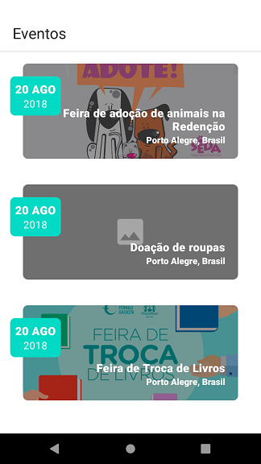
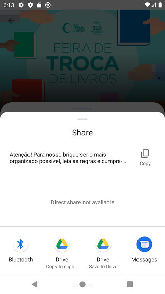
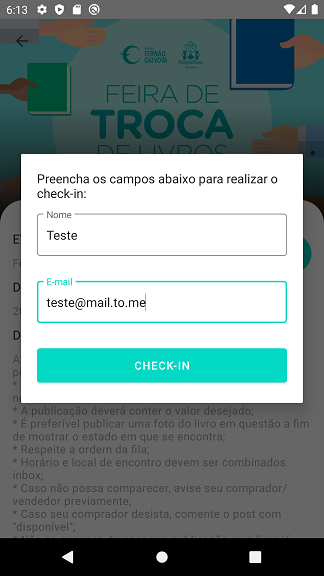

# Eventos

Este projeto é um aplicativo que renderiza uma lista de eventos e seus detalhes a partir de um serviço REST.

## Arquitetura usada
O projeto citado faz uso da arquitetura **MVVM**, conforme recomendações da Google

Mais informações sobre a arquitetura poderão ser consultadas em:
[Guia para a arquitetura do app - Android Developers](https://developer.android.com/jetpack/docs/guide "Guia para a arquitetura do app - Android Developers")

## Bibliotecas utilizadas
- **Material**: componentes que seguem as guidelines da Material Design;
- **Coil**: biblioteca de renderização de imagens em cache, além de possuir uma forma mais simples e atualizada de implementar, possui integração nativa com o Kotlin e com o Coroutines;
- **Lifecycle**: conjunto de bibliotecas necessárias para o uso do Android Architectural Components do Jetpack. Necessárias para a implementação da arquitetura do projeto;
- **Koin**: biblioteca leve e integrada com o Kotlin para implementação de injeção de dependências;
- **Retrofit e Okhttp**: bibliotecas necessárias para realizar requisições com as APIs;
- **Gson**: Necessária para a conversão do retorno das requisições de Json para objetos;
- **Google Maps**: biblioteca utilizada na renderização do mapa na tela de detalhes;
- **JUnit4 e MockitoKotlin**: bibliotecas necessárias para a implementação de testes unitários.
- **Jacoco**: bilbioteca utilizada para a geração de relatórios para cobertura de código.

## Screen Shots

